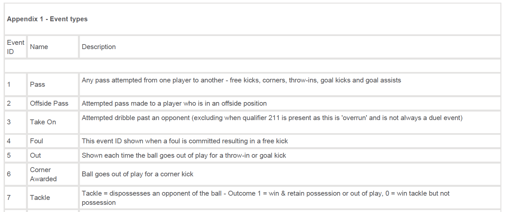

This report documents the approach for my original submission. There will be a supplementary report that documents important changes to this first iteration and alternate approaches to the problem.

### Challenge Objective
The summary objective of the challenge was to predict game events in the second half of the 2016-2017 French League (Ligue 1) soccer season using the game events data for the first half of the season. 

### Data
The main Opta F24 data for the challenge comes in the form of XML files, one for each game in first half of the soccer season. There are 19 gamedays in the first half of season and 10 games (between the 20 teams) occurring on each gameday. Hence, there are 190 xml files describing every event in each of the 190 games. There is also single xml file with information about all the players in the league. Additionally, there are two xml files illustrating a test file before and after the testing data redaction. The data isn't uploaded here (not sure about the confidentiality policies for the challenge). The data from these files were transformed into a form appropriate for the eventually selected modelling approach.

##### Game Data
The xml file for each game contains comprehensive data about the game and for all the events in that game (from the beginning to the end of the game). Every event is time stamped and is accompanied by supplementary data that includes event_unique_id, *player_id* of the player involved in the event, event location on the pitch, event outcome and game period etc. The type of event is given by the *event_id* and there are about 80 different types of event. Examples of different events are given in the figure below



Additionally, every event can have multiple qualifiers that further describes the event. These qualifiers (*qualifier_id*) have specific id and associated values(*value*) when appropriate. The possible combinations of event types and their qualifier(s) is significantly huge. This is understandable since the soccer games and the relevant sequences involved are highly variable, more uncertain and harder to quantify, compared to some other sports.  

For a clearer picture, consider an example where a pass event occurs at a certain time. The pass can be further described with multiple qualifiers like what body part was used to execute the pass, length of pass, angle of pass and pitch location of pass. Some qualifiers require one or multiple values. Additional information about over 300 qualifiers were provided in the supporting documents for the challenge.  

The structure of the XML file for each game can be represented by:

```XML
<Games>
   <Game> 
        <Event> 
            <Event Qualifiers>
        </Event> 
   </Game> 
</Games>
```

##### Players Data
The xml file for player data contains information about every player for every team in the league. The structure of the single XML player data file can be represented by:

```XML
<Soccerfeed>
  <SoccerDocument>
    <Team> 
      <Player>
         <Stat> 
         </Stat>
      </Player>     
    </Team>
  </SoccerDocument>
</Soccerfeed>
```
The relevant nodes here are mostly Team, Player and Stat. Stat contains different pieces of information about the player. These includes first name, last name, weight, height, join date and jersey number etc.

### Approach
It required a couple of iterations but my order of approach to this challenge roughly followed inspecting the data available, understanding the deliverables & constraints, designing an approach, testing the results and modifying any stage of the approach accordingly. The Approach taken involved separate events-based models for each challenge deliverable and significant time spent on event feature analysis and engineering. Before delving further into details of feature selection and modeling for each deliverable, some deliverable analysis and initial data preparation is carried out.

#### Test Procedure
The test data will undergo data redaction as stated in the test procedure for the challenge. Understanding what information will be available guides the approach used for each deliverable. The test procedure is as follows:

* Randomly choose a match from the test database (F24 Opta files of all matches in the second half of the 2016-2017 Ligue 1 season).
* Randomly choose the first or second half for this match.
* Randomly pick 15-minutes of the selected halftime (all events between t and t+15-minutes with t randomly selected).
* Replace all the names of the teams by "1" (home) or "0" (away). In the files, it means replace "team_id" by "1" or "0".
* Delete all the players IDs and write "0" instead, except for one randomly chosen player (who played more than 800 minutes on the learning dataset and did not change team in January). "1" is written for the ID of this specific player. 
	* In the files, it means replace "player_id" by "1" or "0". 
	* In addition, when: Type ID=140, Type ID=141, qualifier_id=140 or qualifier_id=141 appears, the values are replaced by " ".
* Delete all position information (y, x) for all events except the last 10 Opta events within 15-minutes. 
	* In the files, this means that replace "y" with "0" or "x" with "0".
* Remove everything that is written in the F24 files before the first OPTA event. Replace the values of Event timestamp, Event id, Q id and version with " ".
* Reduce some of the information of the last 10 events. In the files it means:
	* For the last 10 events, "outcome" is replaced by " "
	* For the last 10 events, any information about qualifier_ID is gotten rid of.
	  * Meaning: the "value" is replaced by " " and all the "qualifier_id" is replaced by " ".
* Sample test file with before and after test procedure provided.

#### Deliverable Considerations
The three challenge deliverables are summarized below:  

* **Deliverable 1**: given a random and redacted 15-minute sequence of events, predict the identity of a player (player 1, according to the test procedure) participating in one or more events
* **Deliverable 2**: given a random and redacted 15-minute sequence of events, predict whether the team that participates in the next event (after the sequence) is the home (1) or away (0) team.  
* **Deliverable 3**: given a random and redacted 15-minute sequence of events, predict the pitch position of the next event (after the sequence).

The submitted algorithm must return (relatively quickly) a CSV file without a header whose components are four real numbers; Player ID, 1 or 0 for the team at home or away, Y and X. The submitted code should be quick and short. Calculation time on test file should be 5 seconds’ maximum, for the test base file on a laptop computer.  

Evaluation: 50% of the assessment will be based on the first deliverable and 25% on each of the other two. The success score for the first 2 deliverables will be the percentage of correct answers. For the last task an average error in standard L2 will be calculated. The final ranking will be based on the weighted average of the rankings for the 3 tasks.

At first glance, the task seems ideal for models based on recurrent neural network architectures like Long Short-Term Memory. Using the game data for the first half of the season, we could create sufficient training data, consisting of a number of time steps by using a sliding time window over the data. This can be used to train an LSTM model that predicts which *player_id* has the likeliest chance of participating in one or more event given a specific sequence. Similar approach can be considered for the second and third task. However, I decided against the LSTM (or any sequenced prediction) approach for the reasons outlined below (the reasons below reference the first deliverable).

* Given that the 15-minute sequence of events to be tested on the trained model could come from a game between any 2 of the 20 teams in the league, I was skeptical if there could be enough unique events or sequences of events to narrow down a player or all players involved. This skepticism is based upon a couple of years spent watching soccer leisurely.  
* The 15-minute test sequence is stripped of information that would have been useful for effective sequence prediction. These include timestamp, event location, pass origin and pass location. Sequence of events from different soccer games can be quite similar when represented with the available data left.  
* The different qualifiers provided for each event are the features then presumed to provide unique sequences. However, these features are very sparse over the range of event data provided. Attempting to figure out which qualifiers to use might require many trial iterations. The time and computing resources available were not enough for such iterations. All the work for the challenge was carried out on a home laptop, no cloud computing service was used. LSTM models also require more time to tune for hyperparameters.  
* Team specific sequences in the second half of the season can be very different from the first half of the season. For better generalization and more variability in prediction, predictions based on singular events are preferred if possible with good accuracy.
* Furthermore, sequenced predictions are also useful when attempting to identify a group of variables in a sequence, but all the challenge deliverables are ultimately considered as single predictions.

For the second and third deliverable, the above arguments are not as strong but are still relevant. For 20 different teams, the unique or likely sequence of events is tricky to discern without the stripped data and there is not enough time and computing power to figure out the optimal combination of relevant event qualifiers and model hyperparameters.

There is another form of sequenced predictions which involves completing a dependent task based on the predictions from another task. For this challenge, accurate predictions from the first task (predicting *player_id*) would be very useful in the predictions for the second (predicting which team participates in the next event) and third (predicting the position of the next event). This approach was decided against because for a given 15-minute test sequence, the prediction accuracy for the first task can be zero or very low. And since each task is evaluated separately, it makes little sense to jeopardize the subsequent tasks. Furthermore, accurate predictions from the second and third task are not useful when making predictions for the first task on the same test file.

#### Libraries
A couple of R packages are required for data preparation, but all the packages used for the challenge are loaded here. **XML** is used to parse and handle the XML game files, **reshape** is used to transform the data into desired form, **plyr** is used for further manipulating the data and **caret** is used for training the models.

```{r message=FALSE, warning=FALSE}
library(caret)
library(XML)
library(reshape)
library(dplyr)
```

#### Initial Data Preparation
The desired transformation for each game (xml file) is to a table whose rows consists of all the events in that game along with the associated event information. There are about 1700 events in many games so there is about 330,000 events for the 190 games in the first half of the soccer season. Using the **XML** package, the xml file is parsed in its raw form into a R object which maintains its structure. The custom function below is then used for extracting all the attributes from a specific node of the parsed object and presenting in table format. 

```{r}
obtain <- function(parsed, node){
  node_set<- xpathSApply(parsed, paste("//", node, "[@*]", sep=""))
  node_data <- t(lapply(node_set, function(x) xmlAttrs(x)))
  do.call(bind_rows, lapply(lapply(node_data, t), data.frame, stringsAsFactors=F))
}
```

The parsed xml/object has multiple levels or child nodes as shown earlier but the event node is the primary target. The A sample game file is parsed and the *obtain* function is used to extract the event attribute data as shown:
```{r echo=TRUE}
parsed<- xmlInternalTreeParse("sample_game.xml")
Events_attrs <- obtain(parsed, "Event")
```
```{r echo=FALSE}
head(Events_attrs, n=3)
```

While the event node is important, information about the game in which the event occurred and qualifiers further describing the event might be just as important when modeling for the deliverables. However, associated game information won't be available when testing so the table is expanded to only include qualifier data for each event using the code chunk below. The code below and in the rest of this report is mostly written with the testing scenario in mind. A preview of the final events table, (with the qualifiers now represented as feature columns for their respective events) is also depicted.

```{r}
Events_set <- xpathSApply(parsed, "//Event")
Qual_nos <- sapply(Events_set, function(x) sum(names(xmlChildren(x)) == "Q"))
Events_dup <- as.data.frame(lapply(Events_attrs[ ,c("id","event_id","team_id")], function(x) rep(x, Qual_nos)))
Qualifiers <- cbind(Events_dup, obtain(parsed, "Q"))
Qualifiers <- cast(Qualifiers, event_id+team_id~ qualifier_id,fun.aggregate = max)
Events <- merge(Events_attrs, Qualifiers, all.x=T, suffixes=c("Q"))
```
```{r echo=FALSE}
head(Events,n=3)
```

#### Feature Analysis and Selection
The set of features to be used in modeling depends on what features would be available from the test files. Every test file for the three deliverables undergoes some form of data stripping, as described in the test procedure for the challenge. Such stripped features stripped from the test files like *player_id* and *team_id* are not considered as candidates. 

Since the test files can contain unfamiliar event data from distributions arguably different (games in the second half of the season) from the training data, it is difficult to identify which trained model would generalize better. Consequently, feature selection is tricky for this same reason. Popular measures of model accuracy like RMSE or F1-Score should be used solely and confidently as the basis for feature selection. 

After multiple iterations, a set of relevant features, from the event features available in the test files was selected for modeling each deliverable based on **reasonability**, **measure of accuracy**, **requirements of the learning algorithm**, **domain knowledge** and **computing resources**. The table below summarizes the candidate features, selected features for each deliverable/task and some notes on the features. 

Event Feature | Description | Available in test file | 1st Task Model | 2nd Task Model | 3rd Task Model | Notes
|---------- | ------------------------------- | ------------- | ------ | ------ | ------ | --------------------------------- |
*event_id* | unique ID for an event within the game for each team |Yes |`r emo::ji("check")` |`r emo::ji("check")` |`r emo::ji("check")` | Positive integer. It is mostly but not strictly directly proportional to the timed progress of a game. The longer the game has gone, the higher the value of the event_id.
*team_id* |unique ID of the team related to the event | modified |`r emo::ji("multiplication")` |`r emo::ji("multiplication")` |`r emo::ji("multiplication")` | Positive integer originally but transformed to a binary representing whether the team is home or away, in the test file.
*type_id* | describes the type of event | Yes |`r emo::ji("check")` |`r emo::ji("check")` |`r emo::ji("check")` | Positive integer. Events are classified based on the database reference e.g. 7 is a tackle event
*period_id* | the half/period of the game when the event occurred | Yes |`r emo::ji("multiplication")` |`r emo::ji("multiplication")` |`r emo::ji("multiplication")` | Positive integer
*min* | game time minutes | Yes |`r emo::ji("multiplication")` |`r emo::ji("multiplication")` |`r emo::ji("multiplication")` |Positive integer
*sec* | game time seconds | Yes |`r emo::ji("multiplication")` |`r emo::ji("multiplication")` |`r emo::ji("multiplication")` |Positive integer
*outcome* | binary value describing the outcome of certain types of events | deleted for last 10 events |`r emo::ji("check")` |`r emo::ji("multiplication")` |`r emo::ji("multiplication")` | Boolean/Binary values. E.g. outcome is 1 when possession retained after a tackle event and 0 when possession is lost
*x* | location of the event on an x-axis equivalent to the length of the pitch | last 10 events |`r emo::ji("multiplication")` |`r emo::ji("check")` |`r emo::ji("check")` | Decimal Numeric values. 0 is always the defensive goal line and 100 is the attacking goal line
*y* | location of the event on a y-axis equivalent to the width of the pitch | last 10 events |`r emo::ji("multiplication")` |`r emo::ji("check")` |`r emo::ji("check")` | Decimal Numeric values. Right hand touch line is 0 and the left-hand touch line is 100  
*player_id* | unique ID of the player participating in the event | modified |`r emo::ji("multiplication")` |`r emo::ji("multiplication")` |`r emo::ji("multiplication")` | Positive integer originally but transformed to a binary representing whether the player_id is player of interest or not
*keypass* | appears if event led directly to a shot off target, blocked or saved | Yes |`r emo::ji("multiplication")` |`r emo::ji("multiplication")` |`r emo::ji("multiplication")` | Positive integer
*assist* | appears if event led directly to a goal | Yes when present |`r emo::ji("multiplication")` |`r emo::ji("multiplication")` |`r emo::ji("multiplication")` | Positive integer. value of 1 when present
*212 (qualifier_id)* | estimated length (in metres) the ball has travelled during the associated event. | deleted for last 10 events |`r emo::ji("check")` |`r emo::ji("multiplication")` |`r emo::ji("multiplication")` | Qualifier for pass event (when type_id = 1) 
*213 (qualifier_id)* | angle (in radians) that the ball travels at during an event relative to the direction of play. | deleted for last 10 events |`r emo::ji("check")` |`r emo::ji("multiplication")` |`r emo::ji("multiplication")` | Qualifier for pass event (when type_id = 1)
*56 (qualifier_id)* | zone of the pitch where the event occurs | deleted for last 10 events |`r emo::ji("check")` |`r emo::ji("multiplication")` |`r emo::ji("multiplication")` | qualifier for multiple event types. values are "Back", "Left", "Center" or "Right"
*140 (qualifier_id)* | x pitch coordinate for the end point of a pass | No | `r emo::ji("multiplication")` |`r emo::ji("multiplication")` | `r emo::ji("multiplication")` | Linked to pass-based events
*141 (qualifier_id)* | y pitch coordinate for the end point of a pass | No |`r emo::ji("multiplication")` |`r emo::ji("multiplication")` |`r emo::ji("multiplication")` | Linked to pass-based events
*233 (qualifier_id)* | used for any event which is recorded for both teams e.g aerial duels | deleted for last 10 events |`r emo::ji("multiplication")` |`r emo::ji("multiplication")` |`r emo::ji("multiplication")` | Value is the event_id of the same event for the other team
*55 (qualifier_id)* | lists event_id of the assist for a goal or shot | deleted for last 10 events |`r emo::ji("multiplication")` |`r emo::ji("multiplication")` |`r emo::ji("multiplication")` | Positive integer (event_id)
*102 (qualifier_id)* | y pitch coordinate of where a shot crossed goal line | deleted for last 10 events |`r emo::ji("multiplication")` |`r emo::ji("multiplication")` |`r emo::ji("multiplication")` | Decimal Numeric values
*103 (qualifier_id)* | z coordinate for height at which a shot crossed the goal line | deleted for last 10 events |`r emo::ji("multiplication")` |`r emo::ji("multiplication")` |`r emo::ji("multiplication")` | Decimal Numeric values
*44 (qualifier_id)* | describes the player position | deleted for last 10 events |`r emo::ji("multiplication")` |`r emo::ji("multiplication")` |`r emo::ji("multiplication")` | Values are "Goalkeeper", "Defender", "Midfielder", "Forward" or "Substitute". Positions are assigned game by game
*59 (qualifier_id)* | jersey number of player | deleted for last 10 events |`r emo::ji("multiplication")` |`r emo::ji("multiplication")` |`r emo::ji("multiplication")` | Positive Integer
*146 (qualifier_id)* | x pitch coordinate for where a shot was blocked | deleted for last 10 events |`r emo::ji("multiplication")` |`r emo::ji("multiplication")` |`r emo::ji("multiplication")` | Decimal Numeric values
*147 (qualifier_id)* | y pitch coordinate for where a shot was blocked | deleted for last 10 events |`r emo::ji("multiplication")` |`r emo::ji("multiplication")` |`r emo::ji("multiplication")` | Decimal Numeric values

The following observations and considerations were made in selecting model features for the deliverables:  

- *event_id*, *period_id* and *min* are all measures of the timed progress of a game. It seemed important to include such a feature in the models because teams and players tend to routinely perform certain events in different stages of the games. For example, good teams tend to dominate ball possession in the first half of games. *event_id* was selected over the other two features for all the models because it has a larger scale. *type_id* is the other feature common to all the models.  

- *team_id*, *sec*, *player_id* and *keypass* are the other relevant non-qualifier features excluded from the models. 
  * *team_id* and *player_id* are excluded because they have been transformed in the test files of the challenge
  * *sec* is excluded because it did not improve model performance
  * *keypass* and *assist* are excluded because they can be absent and have very high sparsity.
  
  &NewLine;

- *outcome* was included in the model for the first deliverable based on reasonability and model performance. It wasn't considered for the second and third deliverable since it is deleted for the last 10 events

- The event qualifiers used for the first deliverable are *212*, *213* and *56*. None of the other qualifiers were included because their vectors had very high NA-type sparsity, contributed little to modeling efficiency and limited the use of some learning algorithms. They were included based on logic, model performance and algorithm requirements. 
  * *212* and *213* help to classify pass events based on the length and angle of the passes. These are useful for the challenge deliverables because over a number of games, players tend to play passes with similar length and angle for a number of reasons such as their position on the team, team tactics and technical ability. While many of the available event types are important in describing a soccer game, passes can roughly tell the story of a game as well.  
  * *56* provides zone information and thus helps in identify which players are likely to be found in a specific zone when performing an event.  
  
  &NewLine;

- While the last 10 events in the test sequences are important for the second and third deliverable, they hold much less information since their event qualifiers have been stripped. Nevertheless, they contain *x* and *y* data instead and both features have been included in the models as they improve model performance.

- *x* and *y* are important in predicting the position of the next event (Deliverable 3) since they can regulate the predicted values from regression models, which are expected to be used.

#### Final Data Preparation
The final data preparation involves some data cleaning, transformation and feature engineering, based on the conclusions from the feature analysis. The code chunk below details some subsequent data processing operations.

```{r}
#selecting relevant features, renaming and changing feature classes
Events<-transmute(Events,event_id =as.numeric(event_id), team_id = as.factor(team_id), 
                  min =as.numeric(min), sec =as.numeric(sec), player_id = as.factor(player_id), 
                  type_id=as.factor(type_id), outcome=as.factor(outcome), x=as.numeric(x), y=as.numeric(y), 
                  q212 =as.numeric(sub("," , ".", `212`)), q213 =as.numeric(sub("," , ".", `213`)), q56=`56`)
#sorting by minute and seconds (useful for deliverable 2 and 3)
Events <- Events[order(Events$min,Events$sec),] 
```

While only data of a single game has been used to illustrate code in this report, the data used to train and test the actual challenge models was compiled from the 190 xml game files provided. All the data extraction and feature engineering steps shown so far were executed on each game file using a FOR loop. The only differences in that code were a couple of changes to the syntax and order of steps, to speed up the operation. The data_sets from both codes have the same structure. At this stage, that actual challenge data contained about 335,000 events from the 190 games in the first half of the soccer season.

##### New Features
To model for deliverable 2 and deliverable 3, three new features were generated.

- A ***next_team*** feature that denotes which team participated in the event that follows after any given event. 
  - It has a value of 1 if the team in any given event participates in the subsequent event. 
  - It has a value of 0 if the team in any given event does not participate in the subsequent event.
- A ***next_x*** feature that denotes the x pitch coordinate of the event that follows after any given event
- A ***next_y*** feature that denotes the y pitch coordinate of the event that follows after any given event

```{r}
Events <-mutate(Events, next_team =as.factor(if_else(team_id==lead(team_id),1,0)), next_x =lead(x), next_y =lead(y))
```

The *next_team* rule is different from the home or away transformation used in the challenge test procedure for *team_id* but it allows for the exploration of an interesting distribution. This rule enables analysis and modeling for team dominance of events over all teams in the league. On the other hand, using a transformation similar to the one in the test procedure involves approaching event dominance from a home or away perspective. All modeling results were still interpreted using test procedure transformations to meet submission requirements for the challenge.

##### NA values
To decide what to with NA values, we explore which features and deliverables are significantly affected by entries with NA values. The following features have NA values

```{r}
na_count <-sapply(Events, function(y) sum(length(which(is.na(y)))))
na_count[na_count>0]
```

These are the numbers of event entries with NA values for a given feature, out of the 1687 events in the sample game data. Further data exploration results in the following observations and decisions.

- Events with NA *player_id* values are mostly at the beginning and ending of games which involve pre-game and post-game events. These events are mostly not associated with a single player. They are not crucial for completing any of the deliverables and are removed from the dataset. Removing these events also remove the event entries with NA values for *next_team*, *next_x* and *next_y*.  

- Events with NA values for *212*, *q213* and *q56* are mostly non-pass events. While non-pass events are a significant amount, the hypothesis is that pass events alone are adequate enough to tell the 'story' of game, characterize players and predict probable event features. Hence, non-pass events are removed as well.  

- After removing all the event entries with NA, the comprehensive challenge data(stored (**All_Games_Events_NoNA**) dwindled from ~ 335,000 events to ~ 200,000 events. A sample of the final table is shown.

```{r}
Events_NoNA <- na.omit(Events)
```
```{r echo=FALSE}
# sample of final table
Events_NoNA[20:23,]
```
### Modeling

There are 19 gamedays (190 games) in the first half of the season. Using an approximate 75%:25% train-test split, the models for the three deliverables are trained using the first 14 gamedays (140 games) and tested using the next 5 gamedays (50 games). Random splitting is not used because it is desirable for the training data to include events from all players that have played significant minutes. Specifically, **Deliverable 1** challenge requirements involve identifying players who played at least 800 minutes. 

```{r eval=FALSE}
# Finding row position of the first event of the 15th gameday (or Game 141)
Events_N_rows <- mutate(All_Games_Events_NoNA, position = 1:nrow(All_Games_Events_NoNA))
EventsIn1stMin <- mutate(filter(Events_N_rows,min==0), diff=lead(sec)-sec)
Pos_Gm141 <- EventsIn1stMin$position[which(EventsIn1stMin$diff<0)[141]+1]

# train-test split
train<-All_Games_Events_NoNA[1:Pos_Gm141-1,]
test<- All_Games_Events_NoNA[Pos_Gm141:nrow(All_Games_Events_NoNA),]
```

Multiple combinations of training controls, preprocessing options, model hyperparameters and learning algorithms were attempted within the challenge time constraint. The algorithms trialed included Naive Bayes, Random Forest, Adaboost, GLM, Boosted GLM, CART, Adaptive MDA, SVM and NN (light configuration). Since there was no testing available before submission, approach had to be designed for worst case scenario as well. The following sections summarize the selected optimal combinations and results from modeling each challenge deliverable.

#### Predicting player identity (Deliverable 1)
Given the resources constraints, a random forest model was the best performing model for predicting *player_id* based on the selected features. Players missing from the training data period are deleted from the test data since they would not have played at least 800 minutes. There were 21 of such players leaving behind 465 players for classification. The overall model accuracy was **8%**. Exploration of the model predictions indicate significant bias towards a set of players.

```{r eval=FALSE}
# dropping player_id factor levels not in training data
train1 <- mutate(train, player_id= factor(train$player_id))
test1<- na.omit(mutate(test, player_id = factor(player_id,levels(train1$player_id))))

# Training: Random Forest model with no train control
model1<- caret::train(player_id~ event_id+type_id+outcome+q212+q213+q56, data=train1,method="rf", trControl = trainControl(method = "none"))
# Testing
confusionMatrix(predict(model1, test1),test1$player_id)$overall # Accuracy = 0.08
```

#### Predicting team in next event (Deliverable 2)
Given the resources constraints, a CART model was the best performing model for predicting the team that participates in the next event. The modeling was mostly optimized for speed. The overall model accuracy was **74%**.

```{r eval=FALSE}
# Training: CART with 10-fold CV
model2<- caret::train(next_team~event_id+type_id+x+y,data=train, method="rpart", trControl = trainControl(method = "cv",number = 10))
# Testing
confusionMatrix(predict(model2, test),test$next_team) #Accuracy = 0.74
```

#### Predicting position of next event (Deliverable 3)
Given the constraints, GLM models performed best in predicting the position (pitch coordinates) of the next event. The modeling was optimized for speed as well. The RMSE for the y pitch coordinate model was **28.88** and RMSE for x pitch coordinate model was **22.27**.

```{r warning=FALSE, eval=FALSE}
# Training: GLM with no train control (rank deficient warning during training neglected)
model3<- caret::train(next_y~ event_id+type_id+x+y, data=train,method="glm", trControl = trainControl(method = "none"))
model4<- caret::train(next_x~ event_id+type_id+x+y, data=train,method="glm", trControl = trainControl(method = "none"))
# Testing
RMSE(predict(model3, test),test$next_y) #RMSE = 28.88 (rank deficient warning during predict neglected)
RMSE(predict(model4, test),test$next_x) #RMSE = 22.27 (rank deficient warning during predict neglected)

```

### Submission Considerations
Some modifications have to be made to the actual submitted code to meet the requirements of the challenge. The comments below touch on a couple of important modifications.

- Since all non-pass event types have been excluded from the models, predictions cannot be made for non-pass event observations in the test files. Hence, non-pass event observations when extracted from the test files are converted to pass event (using *type_id* = 1). 
  - This makes up for the few cases when the challenge deliverables cannot be met because a non-pass event observation is the last entry in the test sequence or the only entry with the player to be identified. 
  - In the submitted code, this step is carried out just before sorting the extracted data by *min* and *sec*. After sorting extracted data by event time, the predictions are carried out on the **Event** table. The modeling steps in this report for creating new features and removing NA values are not needed for the test file.

```{r}
non_pass <- which(!(Events$type_id %in% c("1", "12", "43")))
Events$type_id[non_pass]<-1
```

- For Deliverable 1, the player to be identified might participate in multiple events within the test 15-minute sequence, so the most popular predicted player_id is selected for such scenarios.

```{r eval = FALSE}
pred1_1 <- predict(model1,Events)
player_id <- names(sort(-table(pred1_1[grep("1",Events$player_id)])))[1]
```

- Deliverable 2 requires prediction about which team (home or away) participates in the immediate event after the test sequence. The model in this report only predicts if it's the same team from the last event of the test sequence, that participates in the immediate event after. 

```{r eval = FALSE}
pred2_1 <- predict(model2,Events,na.action = na.pass)
next_team <-pred2_1[length(pred2_1)] #last event of test sequence
if(next_team=="1") next_team<-Events$team_id[length(pred2_1)] 
if(next_team=="0"&Events$team_id[length(pred2_1)]=="1") next_team<-"0"
if(next_team=="0"&Events$team_id[length(pred2_1)]=="0") next_team<-"1"
```

### Reflections 
As previously mentioned, I had significantly short time to complete the challenge as I joined just two days before the deadline for the challenge which had been available for over a month. This limited my options, but some good results were still obtained. This report documents my original submission. After reflecting, there are some obvious changes I would ideally make to my original submission but that will be detailed in the second report. Model explainability and interpretability will also be investigated in depth in the second report but here are some model reflections before then:

- The low accuracy observed for **Deliverable 1** predictions was expected given the combination of large classes (players), limited differentiating features and limited computing power. From a practical perspective, it is difficult to distinguish between players that have both similar positions and similar traits. By considering only pass event types for modeling, I attempted to improve learning by accounting for team idiosyncrasies. While players can be similar in position and style, their team roles are usually different. Such similar players can be required to mostly play short or long passes, pass to specific players or head rather than shoot. The resulting accuracy while still low for predicting in random sequences performed much better than most of the other fast algorithm-features combination.  

- Modeling for **Deliverable 2** illustrated that the team participating in a given event more than likely participates in the event that follows. This should not be surprising from watching soccer where we can see that team participation (and/or possession) changes less frequently on an event by event basis, but it would not have been as obvious if we were directly modeling to identify the home or away feature of the next event. While there are some event trends for home and away teams from a practical perspective, these trends vary from team to team and game to game and would thus be muddied up over a set of games. For the same set of games, modeling for which team is more likely to participate in a subsequent event, shows greater consistency for this dataset. Conversely, this likelihood can result in heavily biased models when the training is carried out on unbalanced sections of the data. A low bias model was found even though bias might not necessarily be disadvantageous for this type of challenge.  

- The model for **Deliverable 3** can be classified as conservative. The range of pitch coordinate values it predicts is relatively narrow compared to the train and test data. Average error in standard L2 will be used to evaluate performance for this deliverable so RMSE has been used to select the model that predicts closer values on average

### Agenda for the second report
A second report will be authored that details improvements to this report's approach, and alternative approaches that should provide better results. Some of these ideas are rough and have yet to be investigated properly. The agenda for the second report include:

- **Sequenced predictions**: This report argued against sequenced predictions based on resource constraint and deliverable considerations. Nevertheless, this problem generally falls in the area of sequenced predictions of which there are different approaches. The possible limitation to the approaches is the speed of obtaining a prediction.
  - Sequenced predictions based on sequential models that consider top x% prediction using class probabilities. Subsequent models predict within certain constraints. Models can also be combined with mathematical optimization
  - Carefully configuring RNN and LSTM based models (depth depends on resources).  
  
  &NewLine;

- **Feature engineering**: There are still a good number of feature engineering approaches that can improve learning and model performance. They include
  - Reduction of players in training data: Reducing the number of identifiable players can improve model performance for **Deliverable 1** because player differentiation improves. A few comments about this approach
    - Removing players that played less than 800 minutes since they would not be present in the test files. If significantly better model performance can be achieved by increasing limit to 900 minutes, it might be a good idea to increase the limit. This is because such players are less likely to be mainstays in their teams and thus less likely to appear in random sequences from the second half of the season
    - Most soccer teams have established starters and about two or three more players that feature heavily. For the 20 teams in the league, this amounts to amounts to about 280 players. The training data can be filtered to contain only the top 300 players based on their data frequencies. 
  - *event_id* was chosen over *period_id* or *min* to represent timed progress for a typical game. However, the sequence of events in the file for a typical game not strictly correlate with the sequence for *event_id*. It's a good approximation but the events are sequentially recorded in data files based on the game time (minute and second) of event occurrence. Hence, either the *min* feature or total seconds would be a cleaner representation of timed progress for a typical game.
  - Generating new features:
    - Including more combinations of the event qualifiers after evaluating potential contributions. The high sparsity of such features can be useful if neutral values are imputed in the sparse sections. Suggested neutral values for imputation can be trialed after a practical understanding of the qualifier and how it relates to the deliverables.
    - features generated from previous or successive event entries which can include previous event type, next event type etc
    - The players data xml file can be mined for additional features like player position and preferred foot
    - Home and away data which is available in the test files can be included as a feature. This can be particularly useful for **Deliverable 2**.
    - Dividing pitch into about 12 zones and used to reclassify pitch coordinate data for an additional feature.  
  
  &NewLine;

- **Alternative learning algorithms**: I was not able to attempt all the suggested learning algorithms for the deliverables, especially the resource-intensive ones. The algorithm related approaches to be attempted in the second report include one-vs-all classification, similar models in this report but with resource-intensive training and hyperparameter controls and SVM.  

- **External or supplementary data**: It was allowed to incorporate public data available before the season for the dataset in the challenge. I have come across complementary data (might require permissions) that would have been useful and provided better differentiation for all three deliverables.  

- **Model interpretability and analysis **: The models developed in this report would be analyzed further to understand better their assumptions and interpretations. This would educate about relevant steps to improve their performance and compare modeling options.  
  
&NewLine;
&NewLine;

\ \


